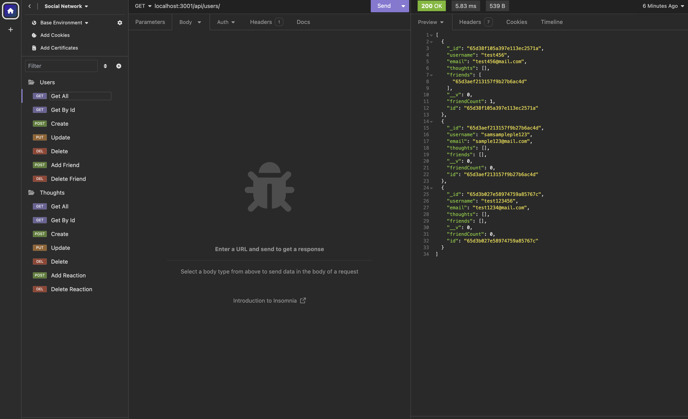

# Social Network

## Description
This project allows the admin to add/delete users, allows Users to friend other users and allows them to leave and react to comments. 

## Table of Contents
- [Installation](#installation)
- [Usage](#usage)
- [Licesnse](#license)
- [Contributing](#contributing)
- [Questions](#questions)

## Installation
You type in NPM run in the server and open insomnia.  Please watch instructional video below.

## Usage
Please watch instructional video

# Social Network

## Description
This project allows the admin to add/delete users, allows Users to friend other users and allows them to leave and react to comments. 

## Screemshot

## Table of Contents
- [Installation](#installation)
- [Usage](#usage)
- [Licesnse](#license)
- [Contributing](#contributing)
- [Tests](#tests)
- [Questions](#questions)

## Installation
You type in NPM run in the server and open insomnia.  Please watch instructional video below.

## Usage
Please watch instructional video.

## License
- MIT
- Link: https://opensource.org/license/mit/   

  

## Contributing
Greag Adams and tutor.

## Tests

## Questions
- Github username: gadams45
- Email address: gadams8340@gmail.com

## License
- MIT
- Link: https://opensource.org/license/mit/   

  

## Contributing
Greag Adams and tutor.

## Tests

## Questions
- Github username: gadams45
- Email address: gadams8340@gmail.com